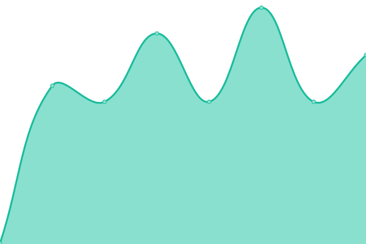
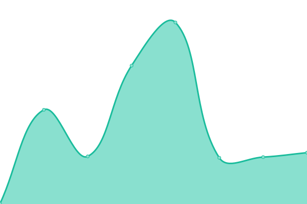
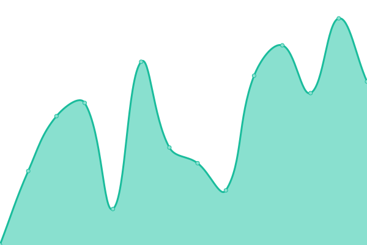

# [📈 Live Status](https://test.amia.work): <!--live status--> **🟧 Partial outage**

This repository contains the open-source uptime monitor and status page for [Amia](https://amia.work), powered by [Upptime](https://github.com/upptime/upptime).

With [Upptime](https://upptime.js.org), you can get your own unlimited and free uptime monitor and status page, powered entirely by a GitHub repository. We use [Issues](https://github.com/Amia33/Upptime/issues) as incident reports, [Actions](https://github.com/Amia33/Upptime/actions) as uptime monitors, and [Pages](https://test.amia.work) for the status page.

<!--start: status pages-->
<!-- This summary is generated by Upptime (https://github.com/upptime/upptime) -->
<!-- Do not edit this manually, your changes will be overwritten -->
<!-- prettier-ignore -->
| URL | Status | History | Response Time | Uptime |
| --- | ------ | ------- | ------------- | ------ |
|  Blog | 🟩 Up | [blog.yml](https://github.com/Amia33/Upptime/commits/HEAD/history/blog.yml) | 

 193ms
     
 | 

<a href="https://test.amia.work/history/blog">100.00%</a>
    

|  Bitbucket | 🟩 Up | [bitbucket.yml](https://github.com/Amia33/Upptime/commits/HEAD/history/bitbucket.yml) | 

 273ms
     
 | 

<a href="https://test.amia.work/history/bitbucket">100.00%</a>
    

|  Cloudflare | 🟩 Up | [cloudflare.yml](https://github.com/Amia33/Upptime/commits/HEAD/history/cloudflare.yml) | 

 173ms
     
 | 

<a href="https://test.amia.work/history/cloudflare">100.00%</a>
    

|  Github | 🟩 Up | [github.yml](https://github.com/Amia33/Upptime/commits/HEAD/history/github.yml) | 

 156ms
     
 | 

<a href="https://test.amia.work/history/github">100.00%</a>
    

|  Gitlab | 🟩 Up | [gitlab.yml](https://github.com/Amia33/Upptime/commits/HEAD/history/gitlab.yml) | 

 558ms
     
 | 

<a href="https://test.amia.work/history/gitlab">100.00%</a>
    

|  Google Firebase | 🟩 Up | [google-firebase.yml](https://github.com/Amia33/Upptime/commits/HEAD/history/google-firebase.yml) | 

 99ms
     
 | 

<a href="https://test.amia.work/history/google-firebase">100.00%</a>
    

|  Netlify | 🟩 Up | [netlify.yml](https://github.com/Amia33/Upptime/commits/HEAD/history/netlify.yml) | 

 221ms
     
 | 

<a href="https://test.amia.work/history/netlify">100.00%</a>
    

|  Render | 🟩 Up | [render.yml](https://github.com/Amia33/Upptime/commits/HEAD/history/render.yml) | 

 303ms
     
 | 

<a href="https://test.amia.work/history/render">100.00%</a>
    

|  Surge | 🟥 Down | [surge.yml](https://github.com/Amia33/Upptime/commits/HEAD/history/surge.yml) | 

 1294ms
     
 | 

<a href="https://test.amia.work/history/surge">98.46%</a>
    

|  Vercel | 🟩 Up | [vercel.yml](https://github.com/Amia33/Upptime/commits/HEAD/history/vercel.yml) | 

 110ms
     
 | 

<a href="https://test.amia.work/history/vercel">100.00%</a>
    

<!--end: status pages-->

[**Visit our status website →**](https://test.amia.work)

## 📄 License

- Powered by: [Upptime](https://github.com/upptime/upptime)
- Code: [MIT](./LICENSE) © [Amia](https://amia.work)
- Data in the `./history` directory: [Open Database License](https://opendatacommons.org/licenses/odbl/1-0/)
